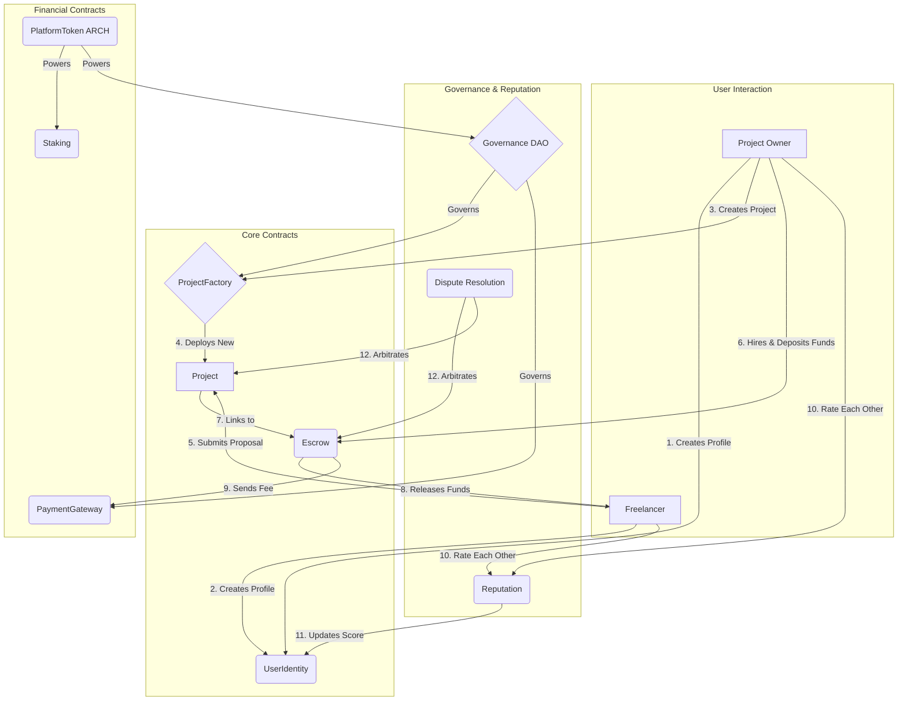

<div align="center">

# 🏛️ The Architect Protocol 🏛️


**A Decentralized, Community-Governed Freelance Ecosystem**

</div>

<p align="center">
  <a href="https://github.com/your-username/architect-project/blob/main/LICENSE">
    
  </a>
  <a href="#">
    
  </a>
  <a href="#">
    
  </a>
  <a href="#">
    
  </a>
</p>

---

**The Architect** is a fully decentralized platform designed to connect freelancers and clients in a trustless, transparent, and fair environment. It replaces the traditional middleman with a sophisticated system of 15 interconnected smart contracts, empowering users with self-sovereign identity, on-chain reputation, and direct control over their funds. The entire ecosystem is governed by its community through a DAO.

## 📖 Table of Content

- [✨ Core Concepts](#-core-concepts)
- [🛠️ Technology Stack](#️-technology-stack)
- [🏗️ System Architecture](#️-system-architecture)
  - [Contract Interaction Flow](#contract-interaction-flow)
  - [Smart Contract Roles](#smart-contract-roles)
- [🚀 Getting Started](#-getting-started)
  - [Prerequisites](#prerequisites)
  - [Installation & Setup](#installation--setup)
  - [Common Hardhat Tasks](#common-hardhat-tasks)
- [🚢 Deployment](#-deployment)
- [🔐 Security Considerations](#-security-considerations)
- [🗺️ Roadmap & Future Work](#️-roadmap--future-work)
- [🤝 Contributing](#-contributing)
- [📜 License](#-license)

## ✨ Core Concepts

The Architect is built on several foundational principles:

-   **🌐 Decentralization:** No central authority or single point of failure. The platform operates autonomously on the blockchain.
-   **🧩 Modularity:** The architecture is composed of specialized, interoperable smart contracts. This isolates risk, simplifies audits, and allows for targeted upgrades.
-   **👤 Self-Sovereign Identity:** Users own their profiles and reputation. This data is portable and cannot be censored or deleted by a central entity.
-   **🔒 Trustless Escrow:** An automated, smart contract-based escrow system secures project funds, releasing them only when both parties are satisfied or a dispute is resolved.
-   **🗳️ Community Governance:** The platform's future is directed by its users. `ARCH` token holders can propose, debate, and vote on all changes to the system.

## 🛠️ Technology Stack

-   **Blockchain:** Ethereum Virtual Machine (EVM) compatible chains.
-   **Smart Contracts:** [Solidity](https://soliditylang.org/) `^0.8.20`
-   **Development Framework:** [Hardhat](https://hardhat.org/)
-   **Contract Libraries:** [OpenZeppelin Contracts](https://github.com/OpenZeppelin/openzeppelin-contracts)
-   **Testing:** [Chai](https://www.chaijs.com/) & [Mocha](https://mochajs.org/) (via Hardhat)
-   **Oracles:** [Chainlink Price Feeds](https://docs.chain.link/data-feeds/) for real-world data.
-   **Dependencies:** `dotenv`, `ethers`

## 🏗️ System Architecture

The Architect is not a single contract but a symphony of contracts working in concert. They are organized into four functional categories: Core, Financial, Governance, and Utilities.

### Contract Interaction Flow

The following diagram illustrates the primary user and contract interactions within the ecosystem:




    # Smart Contract Roles

| Contract             | Category   | Primary Responsibility                                                |
|----------------------|------------|------------------------------------------------------------------------|
| **UserIdentity.sol** | Core       | Manages decentralized user profiles, skills, and reputation.           |
| **ProjectFactory.sol** | Core     | Deploys new Project contracts for each job.                            |
| **Project.sol**      | Core       | Manages the lifecycle of a single job (proposals, hiring).             |
| **Escrow.sol**       | Core       | Holds project funds securely until work milestones are approved.       |
| **PlatformToken.sol** | Financial | The ERC-20 ARCH token for governance and staking.                      |
| **Staking.sol**      | Financial  | Manages staking of ARCH tokens for rewards and voting power.           |
| **PaymentGateway.sol** | Financial | Collects and distributes platform fees as directed by the DAO.         |
| **Governance.sol**   | Governance | The core DAO contract for creating and voting on proposals.            |
| **Reputation.sol**   | Governance | Allows users to rate each other, updating on-chain reputation.         |
| **DisputeResolution.sol** | Governance | A decentralized court for resolving conflicts via jurors.         |
| **NFTCertificate.sol** | Utility  | Mints ERC-721 NFTs as proof-of-completion for freelancers.             |
| **Messaging.sol**    | Utility    | Facilitates secure on-chain pointers to off-chain messages.            |
| **OracleIntegration.sol** | Utility | Fetches external data (e.g., token prices) for budget valuation.   |
| **Proposal.sol**     | Utility    | A helper contract representing a freelancer's bid on a project.        |
| **Invoicing.sol**    | Utility    | A helper contract for freelancers to request milestone payments.       |


# 🚀 Getting Started

Follow these instructions to set up a local development environment.

---

## ✅ Prerequisites
- Node.js **>=18.0.0**
- Yarn or npm
- Git

---

## ⚙️ Installation & Setup

### 1. Clone the Repository
```bash
git clone https://github.com/yAkin-Tunde/DAO-Freelance.git
cd architect-project
```

# 🔐 Security Considerations

⚠️ **This is an educational project and has NOT been audited by a professional security firm. Do not use in production with real funds.**

Implemented best practices:
- **OpenZeppelin Contracts** → using community-vetted standards (ERC20, ERC721, Ownable).  
- **Checks-Effects-Interactions Pattern** → mitigates re-entrancy vulnerabilities.  
- **Access Control** → critical functions protected with `onlyOwner`, `onlyGovernance`, or custom modifiers.  
- **Fail-Fast Philosophy** → extensive use of `require()` to validate inputs and state.  

---

# 🗺️ Roadmap & Future Work

Planned expansions for **The Architect** platform:
- **Layer 2 Integration** → deploy on Arbitrum, Optimism, or other L2 to reduce gas fees.  
- **Advanced Dispute Resolution** → implement more dispute types & appeals process.  
- **Recurring Payments** → subscription-based services for ongoing freelance work.  
- **Private Proposals** → encryption for confidential project proposals.  
- **Enhanced Oracles** → integrate diverse data feeds for complex contract logic.  

---

# 🤝 Contributing

Contributions, issues, and feature requests are welcome!  
Check the [issues page](../../issues).  

### Steps to Contribute
1. **Fork** the project  
2. Create a feature branch  
   ```bash
   git checkout -b feature/AmazingFeature
 ```
---
Commit your changes

git commit -m 'Add some AmazingFeature'


Push the branch

git push origin feature/AmazingFeature


Open a Pull Request

📜 License

This project is licensed under the MIT License.

See the LICENSE file for details.


